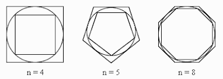
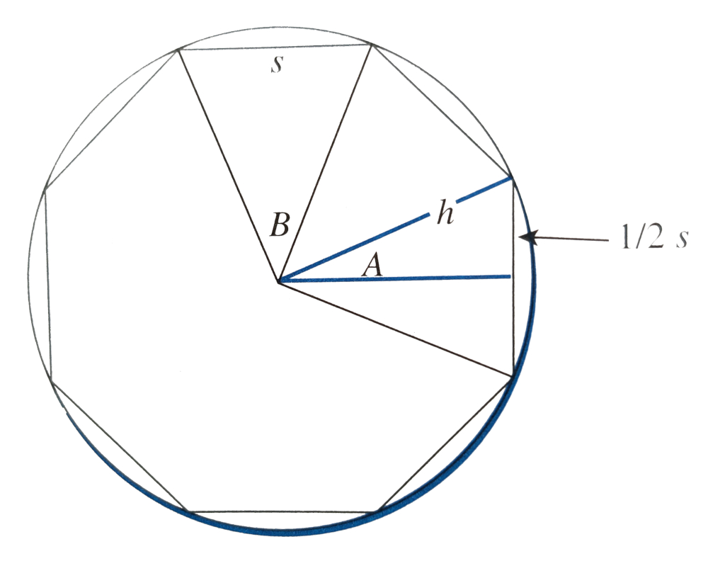
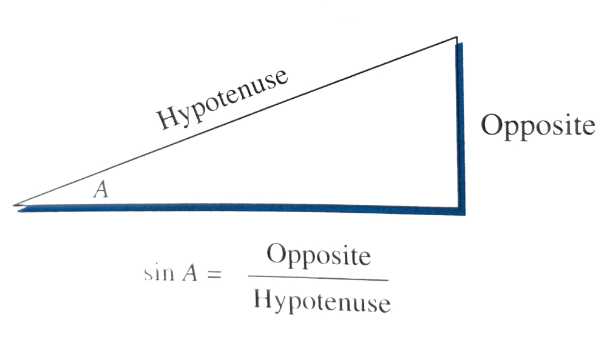

# Java-Assignment-002

## Archimedes Method for determining Pi

Around 250 B.C., Archimedes calculated the ratio of a circle's circumference to its diameter.
Today we know that ratio to be PI, or **Math.PI** in JAVA, but HOW?

* First, he considered the shapes he already understood and that he knew how to calculate the perimeter for, like triangles, squares, and other polygons. 
* Next, Archimedes noticed that if you divide a circle into inscribed polygons (square, pentagon, hexagon, heptagon, octagon, ..., etc.) with an increasing number of sides, each side of the polygon decreased in length, and therefore gave a better and better approximation for the circumference of a circle.

* With this observation, and a little more geometry, we can create an algorithm to calculate the perimeter of larger and larger **inscribed** polygons.
* Remember, the more sides, (n represents the number of sides in the polygon), the more accurate our perimeter estimation is, so let's do the math...

* From the image above, you can see the **octagon** is divided into **isosceles triangles**, the bottom of which (labeled **s**) is the length we need to know.
* If we draw a line from the circle center perpendicular to the base of the triangle **s**, we divide **s** in half, so it becomes ${1 \over 2}s$ as depicted.
* From the picture, we can simplify our lives by assuming $h = 1$, and that the circle is a **Unit circle**.
    * Why can we make this assumption? Remember, we're trying to figure out PI, which we know is the **RATIO** of $Circumference \over Diameter$, and **ratios** don't care what values we assign as long as the ratio holds!
* Also, from the diagram we can see 2 angles **B** and **A** and because of symmetry $A = {1 \over 2}B$
* Great, so now what!?!
    * WELL, we can calculate B, so let's start there. Remember, a Circle is **360°** and we are equally dividing that by **n** sides ($n = 8$ in the example).
    * So... $B = {360° \over 8}$ or $45°$ and $A = {1 \over 2} * B$ so $A = 22.5°$ in our example.
    * Now we can calculate ${1 \over 2}s$ if we recall $sin(A) = {{1 \over 2}s \over h}$ as shown in the below diagram of the triangle.
    
    * Solving for *s* we see $s = 2 * h * sin(A)$
    * And since we agreed $h = 1$, that simplifies to $s = 2 * sin(A)$
    * Now we have *s*, so to get the **polygon perimeter**, we just multiply by the number of sides to get it.
    * Finally, we can calculate PI as $PI = {(n * s) \over 2h}$

OK, so if you've followed the math, feel free to skip ahead and implement calculating PI as an algorithm, but if not lets lay it out a bit more concisely!
* Step 1: Read into an integer the number of sides for our polygon: $n = 8$
* Step 2: Calculate the angle $B = {360.0 \over n}$
* Step 3: Calculate the angle $A = {1 \over 2} * B$
* Step 4: Calculate the length of 1 triangle base $s = 2 * sin(A)$ **HINT: YOU NEED TO CONVERT A to RADIANS**
* Step 5: Get the polygon perimeter $p = n * s$
* Step 6: Estimate PI: $PI = {p \over 2}$

## PART 1 - Implementation
Finally, your assignment is to use the book and other resources to put the above algorithm into a program to estimate PI!
* Fork my repo
* Using IntelliJ clone your fork locally
* Use IntelliJ to activate the Fall 2022 local branch
* Implement the algorithm in ArchimedesPiMethod.java

## PART 2 - Turn in
* When completed, use your IDE to commit your Fall 2022 branch back to your GitHub Account's, Java-Assignment-002/Fall 2022 repo/branch.
* From your GitHub account's branch's page, issue a New pull request from your *Fall 2022* branch to the instructor's *Fall 2022* branch and save the *Pull Request URL*.
* Respond to this assignment with the Pull Request URL.
